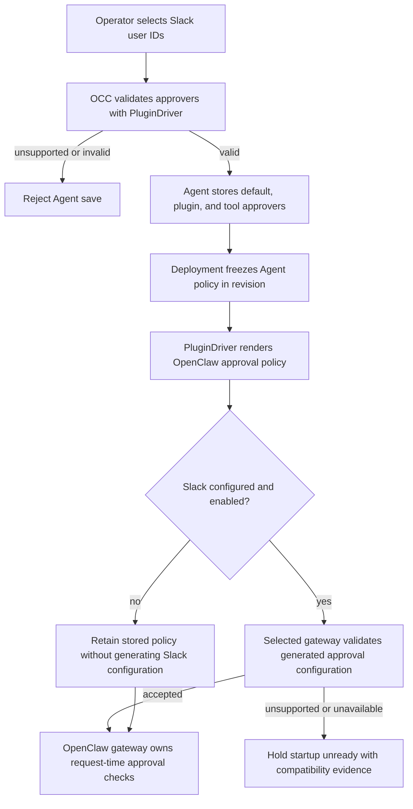

# Agent Plugin Approvals Flow

## Overview

An operator selects Slack users for an Agent's plugin approvals. OpenClaw
Control Plane (OCC) stores exact Slack user identities, freezes the policy in a
deployment revision, and passes it to the selected PluginDriver. OpenClaw owns
authorization of each later plugin approval request. The optional name lookup
is described in the [channel directory flow](agent-channel-directory.md).

## Entry Points

- Trigger: the Console Plugins editor or an authorized caller creates, updates,
  or deploys an Agent with plugin approvers.
- Assumptions: the actor has Agent create or exact Agent update permission, and
  the selected PluginDriver supports approvers.
- Source: `apps/controller/src/console/agents/slack-approvers.mjs:createSlackApproverField`,
  `packages/occ/src/index.ts:OpenClawController.updateAgent`, and
  `apps/controller/src/drivers/plugin/runtime-translator.ts:pluginApprovalOverlay`.

## Flow

## Execution Trace

### 1. Save and freeze approver policy

`packages/occ/src/index.ts:OpenClawController.updateAgent`

Agent `pluginApprovers` supplies the default. A plugin's `approvers` replaces
the default; a tool's `approvers` replaces the plugin list. Omission inherits
and `[]` denies Slack approvers at that scope. The selected PluginDriver
validates supported identities before OCC saves the Agent. The Codex
PluginDriver rejects plugin and tool approvers because Codex approval requests
carry no plugin or tool identity; it accepts only the Agent default. Deploying the Agent
records the current default and selection map in an immutable AgentRevision.
Later edits do not change the admitted revision.
An Agent update sends `pluginApprovers: null` to remove a previously saved
default and return to omitted-policy behavior.

### 2. Hand off runtime enforcement

`apps/controller/src/drivers/plugin/runtime-translator.ts:pluginApprovalOverlay`

The PluginDriver renders raw or workspace-qualified Slack user IDs into the
OpenClaw plugin approval configuration. It preserves unrelated approval
settings and rejects native lists that conflict with an inherited managed list.
An omitted Agent default leaves the runtime's legacy Slack account
approval destinations in effect for scopes without an override; an explicit
empty list denies them. The prepared gateway receives this configuration only
for the admitted revision.

### 3. Check the selected gateway before launch

`apps/controller/src/drivers/compute/kubernetes/runtime-entrypoints.ts:applyOpenClawPluginConfiguration`

The shared Docker and Kubernetes gateway setup omits the generated Slack
approver overlay when `channels.slack` is absent or `enabled: false`. The
admitted policy remains unchanged, including explicit empty lists. Other native
approval settings remain in the effective configuration.

When Slack is configured and enabled, setup writes only the generated approval
policy into a private temporary file and runs the selected image's native
`config validate --json`. This tests the actual configuration contract without
a version cutoff or requiring external plugins to be installed first. The
probe has a 30-second timeout and removes the file afterward. Only a successful
validation permits the policy to be merged into the gateway configuration.

An unsupported policy or unavailable validator holds startup unready before
launching the gateway. Logs tell the operator to select a compatible gateway
image or remove the approver overrides. Kubernetes publishes
`plugin-approvers / INCOMPATIBLE_RESPONSE` startup evidence through its existing
runtime status endpoint. Revision admission still precedes this runtime check;
the worker reads startup evidence during reconciliation. A compatible runtime
owns each subsequent request-time approval decision.

## Debugging and Verification

- Compare `Agent.pluginApprovers`, nested selection overrides, and the admitted
  AgentRevision. A successful save does not prove the running gateway applies
  the new policy; check deployment status and use a real plugin approval request
  to verify the runtime image.
- Raw Slack user IDs can be pasted when directory lookup is unavailable. Directory
  selection still stores workspace-qualified IDs.
- The channel directory flow describes Secret permissions and lookup failures.
  Approval enforcement needs a compatible runtime and an authorized test bot.
- For a gateway that remains unready, check its runtime startup evidence and
  logs for `plugin-approvers`. A capability failure leaves the native
  configuration unchanged and does not launch an invalid gateway.

## Related docs

- [Agent plugin deployment flow](agent-plugins.md)
- [Agent plugin policy](../reference/agent-plugins.md#slack-approver-users)
- [Channel directory flow](agent-channel-directory.md)

## Manual Notes

[keep this for the user to add notes. do not change between edits]

## Changelog

- 2026-09-29 09:30: Reject Codex plugin and tool approvers at admission. (authoring-run/b28f3746-f8be-4f03-9f5e-33cf08d9a535 - d040b86dd780e7a9ac3bbbacf1646203881e2990)

- 2026-09-29 00:11: Check gateway approval compatibility and omit inactive Slack policy. (01a0d4f7-8085-70e0-9d0c-69a465a81fe3 - 33a2528163d5bbff311bb685345e60aadb24a70a)

- 2026-09-28 01:19: Document raw Slack user IDs for plugin approvers. (01a0e579-79b9-7a22-b707-d5bc1e024e31 - f90ca58bf4085a6075faa1c46e75ee96d2fbdafb)

- 2026-09-27 02:03: Describe Agent plugin approval handoff. (01a0df20-f340-7810-bb59-b1df6c0bbbd3 - b2de165412191a4c9d124acf59fa1efb25cc29d6)
