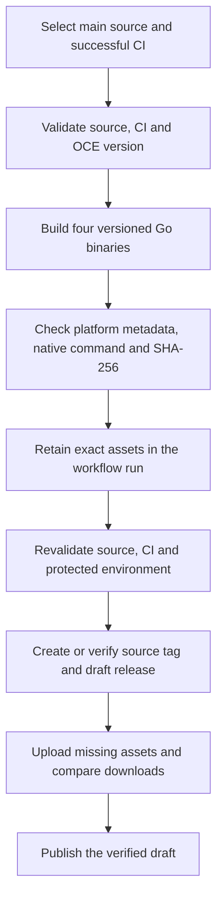

# OCC CLI publication flow

## Overview

The manual CLI release workflow builds versioned `occ` binaries for macOS and
Linux, verifies their platform and checksum identities, and publishes the exact
assets in a GitHub Release. The flow ends when the release is published. It does
not install OCC or publish the Helm chart and container images.

## Entry Points

- `.github/workflows/cli-release.yml:jobs.prepare`: manual dispatch on `main`
  with the exact workflow source SHA and successful main-push CI run ID.
- `scripts/ci/cli-release.mjs:validate`: trusted source and CI gate.
- `scripts/ci/cli-release.mjs:packageCli` and `publish`: cross-platform build,
  protected tag, and release publication.

## Flow

## Execution Trace

### 1. Bind the source to a tested OCE version

`scripts/ci/cli-release.mjs:validate` requires a manual dispatch from this
repository's `main`, a full source SHA matching the selected workflow revision,
and a successful `CI Required` job from the exact main-push CI run. The root
package version and chart `version` and `appVersion` must agree. These checks do
not prove that the chart or images have been published; the operator coordinates
those separate releases from the same source.

### 2. Prepare the binaries before write access

`scripts/ci/cli-release.mjs:packageCli` builds with `CGO_ENABLED=0` for Darwin
and Linux on amd64 and arm64 using pinned Go 1.27.1. The build embeds
`v<version>` in the CLI, checks the source revision and Go platform metadata,
runs `--version` and `--help` on the runner-native
binary, and writes `SHA256SUMS`. The prepare job has read-only repository
permission and retains its output as one workflow artifact. The publication
job consumes that artifact without rebuilding it.
The prepare job passes its artifact name to the publication job, so a
failed-job rerun can use the original build artifact.

### 3. Publish only the verified bytes

`scripts/ci/cli-release.mjs:publish` rechecks source, CI, the protected
`container-publish` environment, and each local checksum. It creates a
lightweight version tag only when none exists; a matching tag is required on a
retry. It finds an existing draft through the authenticated release list,
creates one if absent, and uploads only missing assets,
downloads every asset, and compares each byte with the prepared artifact before
publishing the draft. An existing published release is not modified. A partial
failure leaves a draft and tag for inspection and a matching retry.

This assumes trusted release administrators do not change the tag or draft
during publication. The workflow concurrency group serializes participating
jobs but cannot exclude independent GitHub writers. A competing write between
the asset checks and draft publication could invalidate their binding. The
published release is
the user-facing artifact; the separate chart and image receipt owns deployment
provenance.

## Debugging and Verification

- Run `node --test tests/integration/cli-release.test.mjs` with a writable Go
  cache to build all four binaries, run the native command, and reject a changed
  binary. This does not publish to GitHub.
- Check the selected workflow run's source SHA, prepare artifact, tag target,
  release assets, and `SHA256SUMS`. A draft means publication stopped before the
  user-facing release became available.
- A tag pointing to another source, changed existing asset, or already
  published release stops a retry. Inspect the registry state before dispatching
  again; do not move an established release tag.

## Related docs

- [Publish the OCC CLI](../../.github/cli-publication.md)
- [Set up the OCC CLI](../guides/cli.md)
- [Container publication flow](container-publication.md)

## Manual Notes

[keep this for the user to add notes. do not change between edits]

## Changelog

- 2026-09-28 17:25: Clarified draft lookup and failed-job artifact reuse (authoring-run/185ec4e3-7292-41e3-a669-f574bccc3b16 - fd9ed7f3f50c8e1f9867acb55b2b7bce00c341fa)
- 2026-09-28 15:34: Documented the CLI release build, gate and draft publication path (authoring-run/9245ac4f-d350-4d1e-920b-3d9d638de966 - 7cd4a210d8cf63e6b541427c7d46d7524736a8dc)
