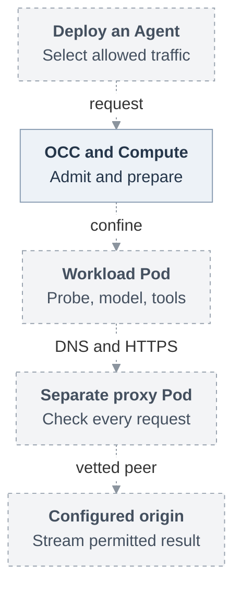
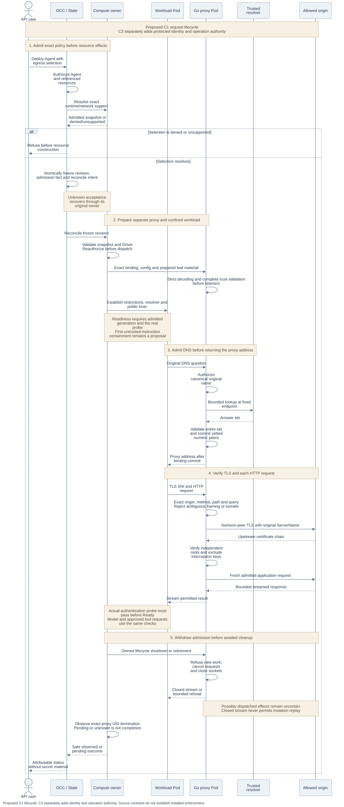

# Egress architecture

**Status:** Superseded

> **Historical custom-proxy proposal:** deferred for 0.x by the
> [current disposition](../../40-agent-egress-0x.md#current-disposition).
> The original contracts below are retained for reference.

[Overview](../../40-agent-egress-0x.md) · [Interfaces](interfaces.md)

The historical design puts policy admission in OCC and State, resource lifecycle
in Compute, and traffic mediation in a separate Go proxy Pod. Existing identity,
permission and credential owners retain their decisions. This page explains the
proposed physical separation and lifecycle, not an installed deployment.

## Historical proposal and reading path

Authorized users select an operator-defined restricted policy or permitted open
compatibility. Workload settings cannot broaden it. The deferred C1 path is:

Historical C1 proposal. Dashed connections require implementation and qualification.
C2 adds the separate private credential-service route. Follow admission below,
then the protocol owner for request checks.

## Components and dependencies

Installation owns Namespace defaults, permitted modes and named policy
generations. It also fixes trusted resolvers, finite limits and immutable runtime
and service images for each offered runtime/network tuple. A tuple is the
specific runtime, networking implementation and topology that an installation has
qualified together. A policy digest does not establish that compatibility.

OCC authorizes admission and State persists the effective policy with the existing
AgentRevision. Shared types belong in Contracts. Compute owns resource creation,
association, readiness, replacement and observed termination. Keep existing
credential extensions and reserve persistence changes through the State owner.

Compute prepares one trusted proxy Pod per revision-owned execution. The proxy
and untrusted Agent must have separate Pods and network identities because
containers sharing Pod networking would share network grants. The proposed
implementation uses the root Go module, a thin `cmd/occ-egress-proxy`, private
`internal/egressproxy` and `deploy/runtime/egress-proxy.Dockerfile`.

Harness authentication, IAM, gateway, plugins, workspace, supported tools,
credentials and Audit retain their owners. Harness and Compute deliver supported
public trust and run the real authentication probe. The proxy issues no IAM
authority. Identity supplies execution evidence for C3, and the credential owner
acquires, injects and settles provider credentials. These conceptual owners do not
imply additional network services.

## Admission and preparation

1. **Resolve before effects.** OCC authorizes the exact Agent and every referenced
   resource. Compute resolves support without changing resources, using the exact
   Namespace, Agent, Harness, authentication, Configuration and selection.
   [Denied or unsupported](interfaces.md#compute-resolution) ends admission before
   network builders run.
2. **Freeze the accepted revision.** The original mutation transaction records the
   effective selection and immutable policy snapshot, mandatory admission fact
   and reconcile intent atomically. The snapshot includes identity, generation,
   digest, exact routes, separate internal peers, qualified tuple, finite bounds
   and any original expiry. Recover uncertain acceptance through that original
   owner. Do not infer rollback or create another revision to hide uncertainty.
3. **Reauthorize dispatch.** The worker validates persisted policy and the selected
   Driver, then reauthorizes before dispatch. It consumes the frozen snapshot
   rather than resolving a changed operator default.
4. **Prepare the complete execution.** Compute creates private configuration,
   network resources and the separate proxy Pod. Existing Secret ownership
   supplies the public interception bundle, exact-origin leaf material and
   independent upstream roots. [Startup validation](interfaces.md#dataplane-startup)
   must finish before listeners open.
5. **Establish readiness.** Probe, gateway and actual tool child receive public
   interception trust through mechanisms supported by the pinned runtime. They
   use normal TLS verification and the controlled resolver. Readiness requires
   the admitted generation, established restrictions and the real model
   authentication probe.

New origins need newly admitted material. Replacement receives distinct resource
identity and newly admitted material, while retirement closes the exact
predecessor.

The pinned [optional-plugin warnings](https://github.com/openclaw/openclaw-enterprise/blob/12fddc4805a1b090331af363ad10bf3b58ea5897/docs/reference/drivers/compute.md#L66-L80)
permit readiness only after failed selections are safely disabled and remaining
checks pass. They cannot relax this RFC's admitted proxy, resolver, protected
receiver, credential, identity or real model-authentication requirements.

## Request lifecycle

Historical C1 proposal, deferred for 0.x. Time flows downward. Solid sequence arrows are requests
and dashed arrows are replies. Existing components and proposed contracts do
not prove these restricted joins or installed enforcement.
[Editable Mermaid source](request-lifecycle.mmd).

After preparation, the proxy authorizes the workload's original DNS question.
It commits vetted numeric upstream peers before returning the proxy address.
It then binds the TLS connection to the admitted origin and checks every HTTP
request before forwarding application bytes. The
[protocol procedures](protocol-and-routing.md) own these checks and their distinct
validity clocks.

A permitted request can stream its result within admitted bounds. Rejection sends
no unintended application bytes to the denied receiver. Stop, retirement,
applicable expiry or shutdown withdraws admission before awaited cleanup.
Compute separately observes physical termination.

This is C1 confinement. C3 additionally needs the authentic original invocation,
current execution and operation authority at the protected receiving boundary.
The DNS decision and a matching HTTP route cannot supply that authority.

## Network containment

Compute alone stamps exactly one positive `openclaw.dev/network-profile` class
on each managed Pod:

| Class                  | Permitted role                                                        |
| ---------------------- | --------------------------------------------------------------------- |
| `broad-egress-v1`      | Supported open compatibility.                                         |
| `restricted-egress-v1` | Workload traffic through admitted mediation and exact internal peers. |
| `egress-proxy-v1`      | Trusted proxy with its separately scoped grants.                      |

Missing or unknown classes receive no compatibility grants. Existing ordinary
workloads require a trusted classification transition before legacy grants are
replaced. Workload configuration cannot opt itself into a broader class.

Preserve default-deny and approved ingress. Positively select compatibility Pods
for ordinary DNS grants and open Pods for runtime/authentication public-443
grants. Kubernetes policies are additive, so a restrictive policy cannot cancel
a broad grant from another selecting policy. Inspect the complete union of
transport, channel, plugin (including private status), Helm and Sandbox policies in managed and adopted
Namespaces. Reject unsupported Sandbox composition or verify every policy its
producer installs before activation.

Selectors cover embedded `gateway` and admitted dedicated `agent` roles. They
must include full Namespace, Agent, revision, role and service/resource-generation
ownership. Agent-only selectors cannot authorize a retired execution. A stable Deployment name
is not immutable execution identity. Proxy
labels and placement must not inherit controller DNS, database or Kubernetes API
grants.

Restricted Pods use `dnsPolicy: None` with the exact revision resolver. They can
reach only their proxy's DNS/TLS listeners and separately admitted internal peers
and ports. Proxy grants identify exact resolver/control peers and necessary
public upstream paths. Qualify UDP and TCP DNS through the actual resolver
Service virtual IP and backend topology early. Unsupported tuples fail before
resource construction, without ambient DNS or broad-CIDR fallback.

Preserve the pinned [private plugin-status path](https://github.com/openclaw/openclaw-enterprise/blob/12fddc4805a1b090331af363ad10bf3b58ea5897/docs/reference/drivers/kubernetes-compute/networking-and-isolation.md#L12-L26)
when enabled selected plugins require it. Operator-configured
`network.pluginStatusProxySourceCidrs` admits precise API-server Pod-proxy sources
to the owned workload's TCP/18791 only. Prefer individual `/32` or `/128` sources
and verify the actual CNI/overlay addresses. Missing sources add no ingress rule.
The [worker's `get` on `pods/proxy`](https://github.com/openclaw/openclaw-enterprise/blob/12fddc4805a1b090331af363ad10bf3b58ea5897/deploy/helm/openclaw-enterprise/templates/rbac.yaml#L49-L62)
is separate from workload grants. Dedicated Codex also needs its
[gateway-to-Agent status path](https://github.com/openclaw/openclaw-enterprise/blob/12fddc4805a1b090331af363ad10bf3b58ea5897/docs/reference/drivers/kubernetes-compute.md#L191-L223)
on TCP/18791. Apply this RFC's full revision/role/generation ownership to that
peer. These control paths grant no workload Kubernetes API access,
unrelated private access or additional public egress. Unavailable or untrusted
required status withholds readiness.

Direct public-IP access, alternate DNS, DNS-over-TLS, DNS-over-HTTPS, IPv6 and QUIC
must remain unreachable. The same requirement covers siblings, private and
metadata networks, node-local or host-network paths and forbidden platform
services, except exact admitted internal peers. Measure these denials for the
selected CNI and runtime. If required node/private-path denial cannot be
established, activation fails.

Restrictions must precede readiness. The separately proposed stronger startup
rule is described below and does not replace this mandatory gate.

## Protected receivers

C2 adds the credential owner's exact private route for managed Git/`gh`. Its
[service peer, CA and session](protocol-and-routing.md#private-repository-route)
remain distinct from the model interception route. Embedded C2 can complete
before dedicated delivery.

C3 reuses one proxy per actual current execution assignment. State and Compute
observe the incarnation and enforce private ingress. The
[identity proposal](https://github.com/openclaw/openclaw-enterprise/pull/247)
owns constrained operator-managed SPIRE registration, rotating relay identity
and opaque evidence from the actual receiving connection. A relay certificate
identifies the relay. Trusted assignment and ingress associate the Agent, without
proving which container in that Pod sent a request.

The mandatory preparation order is:

1. Observe the runtime with protected serving disabled, then bind its incarnation.
2. Persist the immutable execution-bound credential attempt.
3. Open the session and read back its accepted result.
4. Deliver material without changing incarnation.
5. Validate currentness, then enable protected serving.

An incarnation change requires fresh admission. **Owner integration proposal:**
separate observation from readiness. After immutable delivery, run an
authorized protected bootstrap probe. Establish current-serving selection and
predecessor withdrawal before enabling serving. Compute, Harness, identity and
credential owners must define the probe's purpose and authority without
impersonating a human. Bound or Ready does not itself mean current serving.

Egress owns the accepting Go listener and authenticated Go–TypeScript bridge.
The bridge must preserve the same native connection, request, stream and
recipient across waits and dispatch. Identity verification and credential
effects remain with their existing owners. The
[receiving contract](interfaces.md#receiving-bridge) retains exact-peer selection,
original waiters and final fences as integration gates.

**Proposal — security, Compute and CNI decision pending:** qualify containment
before any untrusted init, startup, tool or replacement instruction, or refuse
activation. Policy creation, readback and fixed delays do not prove enforcement.
Kubernetes provides no standard enforcement acknowledgment.
[NetworkPolicy lifecycle](https://kubernetes.io/docs/concepts/services-networking/network-policies/#pod-lifecycle)
explains why this mechanism requires qualification.

## Availability and tradeoffs

Open mode preserves approved networking, authentication, sessions, IAM and tenant
isolation. It grants no arbitrary private access and records absent execution
assurance. At the historical baseline `724dcb5`, Kubernetes compatibility
includes namespace DNS and public-IPv4 TCP/443. Docker, SSH and external Drivers
retain supported open behavior and reject unsupported restricted profiles.

Restricted execution either runs its admitted profile or fails admission or
activation. Proxy, resolver, certificate, identity, renewal or other dependency
loss never selects open. Pinned-certificate, IP-literal, opaque and HTTP/2-only
clients need independently authorized compatibility or remain unsupported.

Finite exact routes and prepared leaves bound policy and certificate custody.
They avoid wildcard policy, an online CA and generic discovery. Reuse reviewed
DNS/TLS admission, verification and closure invariants with their defensive cases.
Copied material retains source and modification attribution, applicable notices
and licenses, plus dependency inventory in source and distribution records.

Add no new issuer, credential registry, audit store, runtime supervisor or general
Provider framework. This design introduces no VM, nftables, shared-memory
admission or replacement Harness machinery, and no C1 lease system or close RPC.
[Delivery decisions](delivery.md#decisions-and-follow-ups) identify the owner and
proof required to expand this scope.
